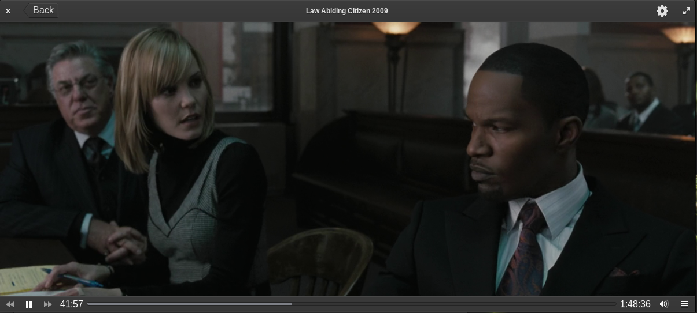

# Videos2

 </img>

A new vision for the EOS video player.
* Refused the clutter-gst (it seems more stable without it).
* Added some features (such as volume control) that had no place in the original.
* The library will be restored, but slightly modified (it is useless in its current form).

## Building, Testing, and Installation

You'll need the following dependencies:
* libgtk-3-dev
* libgee-0.8-dev
* libgranite-dev
* gstreamer1.0-gtk3
* gstreamer1.0-libav
* gstreamer1.0-plugins-base
* libgstreamer1.0-dev
* libgstreamer-plugins-base1.0-dev
* meson
* valac

## How To Build

    meson build --prefix=/usr
    ninja -C build
    sudo ninja -C build install

## Run
    io.elementary.videos2
